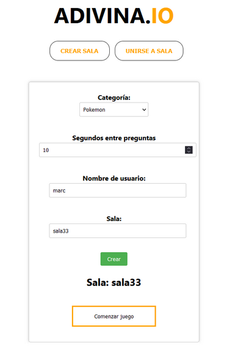
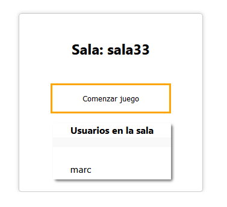
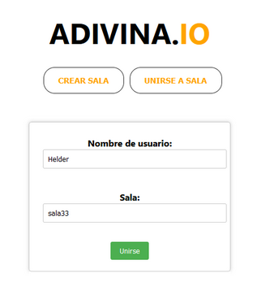
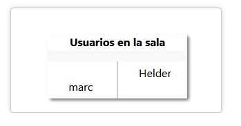
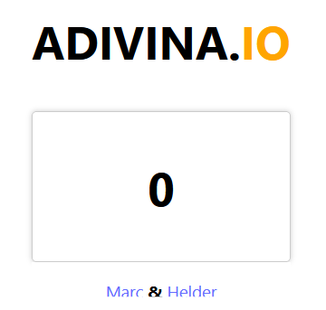
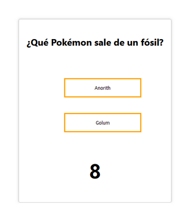
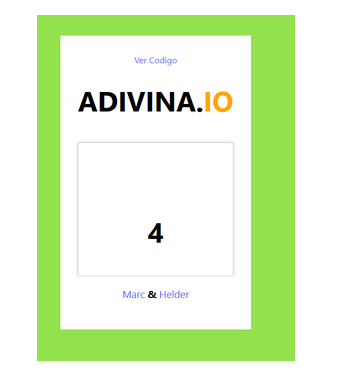
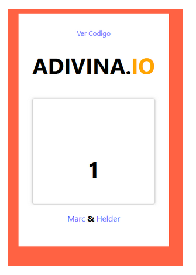
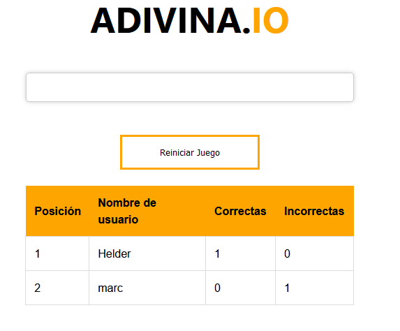

# Adivina.io
El proyecto trata sobre un juego de preguntas y respuestas en el que hemos estado trabajando en el entorno de programación web Socket.io. Socket.io sirve como un puente que conecta el backend y el frontend, gracias a este sistema el usuario no debe estar constantemente lanzando peticiones al backend para saber si debe actualizar algo o mostrar algo.

## Manual de uso

### Crear sala: 
1. Damos al boton crear sala
2. Seleccionamos categoría y los segundos por pregunta
3. Ponemos usuario y nombre de sala
4. Le damos a crear
 

5. Esperamos a los usuarios.
6. Le damos a comenzar juego

### Unirse a sala:
1. Hacemos clic al botón unirse a sala
2. Introducimos nuestro nombre y la sala a la que queremos unirnos
3. Hacemos clic a unirse

4. Esperamos a que el anfitrión le dé a empezar

5. Esperamos un rato ( Hay un fallo de la lógica que hace que tarde los segundos del setInterval en arrancar )

6. Vemos la pregunta y podemos seleccionar una de las opciones

7. Hemos acertado la pregunta y faltan 4 segundos para la siguiente

8. Hemos fallado la pregunta y nos queda 1 segundo para la siguiente pregunta

9. Vemos el ranking: 

